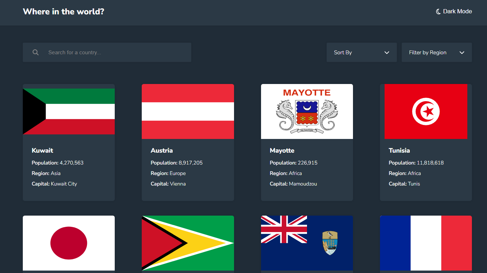

# Frontend Mentor - REST Countries API with color theme switcher solution

This is a solution to the [REST Countries API with color theme switcher challenge on Frontend Mentor](https://www.frontendmentor.io/challenges/rest-countries-api-with-color-theme-switcher-5cacc469fec04111f7b848ca). Frontend Mentor challenges help you improve your coding skills by building realistic projects.

## Table of contents

- [Overview](#overview)
  - [The challenge](#the-challenge)
  - [Screenshot](#screenshot)
  - [Links](#links)
- [My process](#my-process)
  - [Built with](#built-with)
  - [Intro](#intro)
  - [What I learned - Style](#what-i-learned---style)
  - [What I learned - JS/REACT](#what-i-learned---js/react)
  - [What I learned - Other Tools](#what-i-learned---other-tools)
  - [Extra Features](#extra-features)
  - [Continued development](#continued-development)
  - [Useful resources](#useful-resources)
- [Author](#author)

## Overview

### The challenge

Users should be able to:

- See all countries from the API on the homepage
- Search for a country using an `input` field
- Filter countries by region
- Click on a country to see more detailed information on a separate page
- Click through to the border countries on the detail page
- Toggle the color scheme between light and dark mode _(optional)_

### Screenshot



### Links

- Solution URL: [here](https://github.com/rafaeldevvv/rest-countries-api)
- Live Site URL: [here](https://rafaeldevvv.github.io/rest-countries-api/)

## My process

### Built with

- Semantic HTML5 markup
- CSS custom properties
- Flexbox
- CSS Grid
- Mobile-first workflow
- RESTful API
- SASS
- Webpack
- JSX
- Font Awesome Icons
- [React](https://reactjs.org/) - JS library
- [React Router](https://reactrouter.com/en/main) - React feature

### Intro

This is quite a complex project and I added some extra features to make it more challenging.

I think I organized the files very well now. I am pretty proud of my evolution.

### What I learned - Style

I used the orientation media feature for the first time here because I didn't like the style in the Ipad Pro. So this was the solution:

```scss
@media (min-width: 992px) and (orientation: landscape) {
  section#details {
    margin-top: 13vh;

    .country-info {
      display: flex;
      gap: min(10vw, 10rem);
    }

    .flag {
      width: 45%;
      margin: 0;
    }
  }
}
```

First time I used css variables like this too. I thought of using classes like dark-background, light-background etc, the prefix(light or dark) would be in the context, but I wanted to practice using css variables so I used it.

```scss
:root {
  --text: hsl(200, 15%, 8%);
  --element-background: hsl(0, 0%, 100%);
  --background: hsl(0, 0%, 98%);
  --input: hsl(0, 0%, 52%);
}
```

### What I learned - JS/REACT

First time I used React router. I liked it. I use the country cca3 to retrieve the countries, but I named the parameter as identifier because it can be other things like cca2, ccn3 and the country code.

```jsx
const router = createBrowserRouter([
  {
    path: "/",
    element: <Root />,
    errorElement: <ErrorPage />,
    loader: rootLoader,
  },
  {
    path: "/countries/:identifier",
    element: <DetailPage />,
    errorElement: <ErrorPage />,
    loader: countryLoader,
  },
]);
```


The optional chaining operator is really useful. First time I used it in practice and I intend to use it more often.

```js
function CountriesApp() {
  // ...
  const regions = countries?.reduce((regions, currentCountry) => {
    if (!regions.includes(currentCountry.region)) {
      return [...regions, currentCountry.region];
    } else {
      return regions;
    }
  }, []);

  //...
}
```


I am really proud of this custom select list I built. I used a lot of aria attributes to improve accessibility and make it usable. I included the reset text because it would be quite annoying having to reload the page to show all countries again.

```jsx
export function SelectList({
  options,
  selectedOption,
  onSelect,
  defaultText,
  resetText,
}) {
  const [isShowing, setIsShowing] = useState(false);

  return (
    <div
      className="select-field"
      onClick={() => setIsShowing(!isShowing)}
      aria-haspopup="listbox"
      aria-owns="options-list"
      aria-controls="options-list"
      aria-activedescendant={isShowing ? selectedOption : undefined}
      tabIndex="1"
    >
      <span className="selected-value">{selectedOption || defaultText}</span>
      <FontAwesomeIcon icon={icon({ name: "chevron-down" })} />
      <ul
        className={`options-list ${isShowing ? "visible" : ""}`}
        aria-expanded={isShowing}
      >
        {selectedOption && (
          <li onClick={() => onSelect(null)} key="reset">
            {resetText}
          </li>
        )}
        {options.map((o) => (
          <li onClick={() => onSelect(o)} key={o}>
            {o}
          </li>
        ))}
      </ul>
    </div>
  );
}
```


I wanted to use the script in the head tag and just use an tag with the proper class but I discovered this React component to display font awesome icons and I wanted to try it.

```js
import { FontAwesomeIcon } from "@fortawesome/react-fontawesome";
import { icon } from "@fortawesome/fontawesome-svg-core/import.macro";
```


If you've read my code you might have wondered why I passed the countriesSorter as prop if the sort method is pure. Well that's because later on I passed the typesOfSorting property of the countriesSorter object down to the SearchBar component. If I hadn't done that I would be accessing a variable outside the function making it impure.

```js
function CountriesApp({ initialTheme, countries, countriesSorter }) {}
```


This is a very simple way I found to filter the countries.

```js
export default function getFilteredCountries(countries, name, region) {
  const escaped = name.replace(/[\/\\$^.*|)(\[\]\{\}]/g, "\\$&");
  const nameRegExp = new RegExp(escaped, "i");

  let filteredCountries = countries.filter((c) =>
    nameRegExp.test(c.name.common)
  );
  if (region) {
    filteredCountries = filteredCountries.filter((c) => c.region === region);
  }

  return filteredCountries;
}
```


i thought of using this function to get the items from the country object. But that's totally unnecessary. I just wanted to share it:

```js
function getDataFromCountry(items) {
  const data = [];

  function getItemFromPath(path, handler) {
    const parts = path.split(".");
    let current = country;
    parts.forEach((p) => {
      current = current[p];
    });
    return !!handler ? handler(current) : current;
  }

  items.forEach((item) => {
    data.push({
      key: item.name,
      value: getItemFromPath(item.path, item.handler),
    });
  });

  return data;
}
```

### Extra Features

I added two extra features to this project: a sorting mechanism that allows the user to sort the list of countries and a suggestion of a country name and region when the country that the user is looking for is not found.


I wanted a convenient way to add and remove sorting types. So I got inspiration from the design pattern called factory pattern and built this object to register sorting types.

```js
class ObjectSorter {
  constructor() {
    this.typesOfSorting = [];
    this.compareFunctions = {};
  }

  register(typeOfSorting, compareFunction) {
    this.typesOfSorting.push(typeOfSorting);
    this.compareFunctions[typeOfSorting] = compareFunction;
  }

  sort(objects, typeOfSorting) {
    const copied = objects.slice();
    copied.sort(this.compareFunctions[typeOfSorting]);
    return copied;
  }
}
```

This is the function to get the Levenshtein distance between two strings. It is kind of complex, so if you wanna know how this works you can read [this page](https://medium.com/@ethannam/understanding-the-levenshtein-distance-equation-for-beginners-c4285a5604f0).

```js
export default function levDistance(string1, string2) {
  if (typeof string1 !== "string" || typeof string2 !== "string") {
    throw new Error("levDistance expects strings as arguments");
  }

  const string1Length = string1.length;
  const string2Length = string2.length;

  const matrix = new Array(string1Length + 1);
  for (let i = 0; i <= string1Length; i++) {
    matrix[i] = new Array(string2Length + 1);
    matrix[i][0] = i;
  }

  for (let j = 0; j <= string2Length; j++) {
    matrix[0][j] = j;
  }

  for (let i = 1; i <= string1Length; i++) {
    for (let j = 1; j <= string2Length; j++) {
      matrix[i][j] = Math.min(
        matrix[i - 1][j] + 1,
        matrix[i][j - 1] + 1,
        matrix[i - 1][j - 1] + (string1[i - 1] !== string2[j - 1] ? 1 : 0)
      );
    }
  }

  return matrix[string1Length][string2Length];
}
```

I got inspiration from Google to make this feature. It only appears when there is no match for the country the user is looking for.

```js
function CountriesApp() {
  const closestCountry =
    searchedCountry && sortedCountries.length === 0
      ? getClosestCountry(countries, searchedCountry)
      : null;
}
```

### What I learned - Other tools

You might also be wondering why I am able to access the React object as if it was a global variable. That's because I used this webpack configuration.

```js
const path = require("path");
const webpack = require("webpack");

module.exports = {
  mode: "production",
  entry: "./src/index.jsx",
  output: {
    path: path.resolve(__dirname, "dist"),
    filename: "bundle.js",
    publicPath: "/",
  },
  module: {
    rules: [
      {
        test: /\.(js|jsx)$/,
        exclude: /(node_modules|bower_components)/,
        use: {
          loader: "babel-loader",
          options: {
            presets: ["@babel/preset-env", "@babel/preset-react"],
            plugins: [
              "babel-plugin-macros",
              "@babel/plugin-proposal-class-properties",
              "@babel/plugin-proposal-optional-chaining",
            ],
          },
        },
      },
      {
        test: /\.css$/,
        use: ["style-loader", "css-loader"],
      },
    ],
  },
  plugins: [new webpack.ProvidePlugin({ React: "react" })],
  resolve: {
    extensions: [".*", ".js", ".jsx"],
  },
  devServer: {
    historyApiFallback: true,
    contentBase: "./dist",
    hot: true,
    port: 8080,
  },
};
```

The ProvidePlugin method makes it possible to make React be like a global variable in my code.

Also, I used the [Thunder Client](https://www.thunderclient.com/) extension for VS Code to help me see how the REST Countries API works.

### Continued development

This was hands down the biggest project I have ever built until now. I realized there's still a lot I need to learn and improve.

One thing that I realized is about performance. This is application is kind of cumbersome to use and I don't know how I could improve it(maybe it is because I am making requests to the actual API instead of the local data.json). So I am gonna study more about performance.

### Useful resources

- [Levenshtein Distance Explanation](https://medium.com/@ethannam/understanding-the-levenshtein-distance-equation-for-beginners-c4285a5604f0) - This helped me understand what is going on behind the scenes of the levenshtein distance algorithm.
- [React Router](https://reactrouter.com/en/main/start/tutorial) - A quick tutorial to learn the basics of React Router.
- [chatGPT](https://chat.openai.com/) - Again, PERFECT!
- [API YouTube video](https://youtu.be/WXsD0ZgxjRw) - This made me understand what APIs(especially RESTful APIs) are and how they work.
- [REST Countries API](https://restcountries.com/) - This helped me make request to the api.
- [W3 schools Media Query Reference](https://www.w3schools.com/cssref/css3_pr_mediaquery.php) - I hadn't used the orientation media feature before so I needed to take a look at it again.
- [Font Awesome React Icons](https://fontawesome.com/docs/web/use-with/react/) - This helped me use the FontAwesomeIcon component.

## Author

- Instagram - [@rafaeldevvv](https://www.instagram.com/rafaldevvv)
- Frontend Mentor - [@rafaeldevvv](https://www.frontendmentor.io/profile/rafaeldevvv)
- Twitter - [@rafaeldevvv](https://www.twitter.com/rafaeldevvv)
